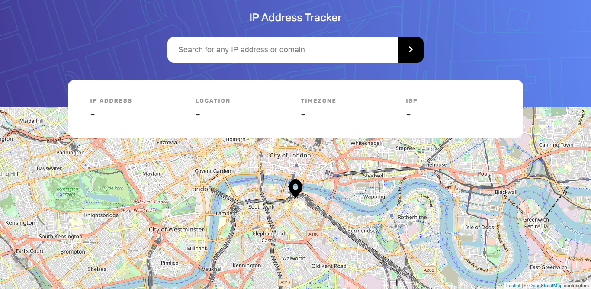
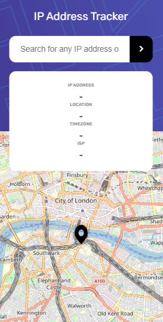

# Frontend Mentor - IP address tracker solution

This is a solution to the [IP address tracker challenge on Frontend Mentor](https://www.frontendmentor.io/challenges/ip-address-tracker-I8-0yYAH0). Frontend Mentor challenges help you improve your coding skills by building realistic projects.

## Table of contents

- [Overview](#overview)
  - [The challenge](#the-challenge)
  - [Screenshot](#screenshot)
  - [Links](#links)
- [My process](#my-process)
  - [Built with](#built-with)
  - [What I learned](#what-i-learned)
  - [Reflection](#reflection)
  - [Useful resources](#useful-resources)
- [Author](#author)

**Note: Delete this note and update the table of contents based on what sections you keep.**

## Overview

### The challenge

Users should be able to:

- View the optimal layout for each page depending on their device's screen size
- See hover states for all interactive elements on the page
- See their own IP address on the map on the initial page load
- Search for any IP addresses or domains and see the key information and location

### Screenshot

### Links

- Solution URL: [View](https://github.com/hafezfhmi/fem-ip-address-tracker)
- Live Site URL: [View](https://easyiptracker.netlify.app/)

## My process

### Built with

- [React](https://reactjs.org/) - JS library
- [React Leaflet](https://react-leaflet.js.org/) - JS Library for maps
- [ipify API](https://www.ipify.org/) - A Simple Public Address API

### What I learned

- Develop using mobile-first approach
- Utilizing context to manages state
- Developing a project by consuming an API with axios
- Using Leaflet library for interactive map

### Reflection

I still need a lot of practice in using React overall. While I'm getting better at the basics, the advanced aspects of React (useContext and other React hooks) needs more practice. The file structure also tends to be messy because of the numbers of css files. React styled components might help in future projects to clean up the project file structure.

### Useful resources

- [React useContext hooks](https://www.youtube.com/watch?v=5LrDIWkK_Bc&t=649s) - Helped me in simplifying the usage of useContext hooks to manage my states.
- [Updating React Leaflet center attributes](https://stackoverflow.com/questions/64665827/react-leaflet-center-attribute-does-not-change-when-the-center-state-changes) - Helped me to update the center of leaflet map when the state of latitude and longitude changed.

## Author

- Github - [Hafez Fahmi](https://github.com/hafezfhmi)
- Frontend Mentor - [@hafezfhmi](https://www.frontendmentor.io/profile/hafezfhmi/solutions)
